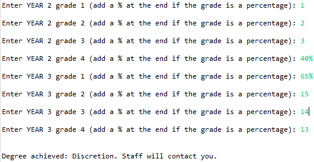

# University-Student-Grade-Classification 

- Implemented a university's Grading System by following the description on the university's website
- Used the IDE's Code Coverage feature and numerous testing methods, such as equivalent classes, boundary value analysis, control flow graphs, parameterised tests to increase the branch coverage of class files to 100%.

<u><b>Utilised:</b></u> Java, JUnit, OOP, Testing and Verification methods      

  <b>A console interface is shown below, which was created solely for demonstration purposes.</b>

